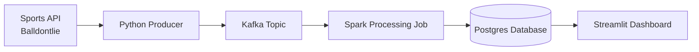

# sports_streaming_pipeline

## Project overview
This project implements an end-to-end data engineering pipeline for ingesting and processing sports data.
The pipeline retrieves data from several sports APIs, streams the data through Kafka, processes it using Spark, 
and stores the results in a PostgreSQL database. A Streamlit application is used to visualize the processed data.
The initial project phase focuses on NBA game score data using the BALldontlie API. Future additions may 
include additional NBA datasets as well as other leagues such as the NFL and NHL.


## Architecture


Pipeline flow:

1. A Python producer retrieves sports data from APIs.
2. The producer publishes events to a Kafka topic.
3. Kafka stores the event stream.
4. A Spark job consumes the Kafka topic and processes the data.
5. Processed results are written to a PostgreSQL database.
6. A Streamlit application visualizes the stored data.


## Tech Stack
- Python
- Apache Kafka
- Apache Spark / PySpark
- PostgreSQL
- Streamlit
- Docker


## Quickstart
1. Clone the repository:
```bash
git clone <repo>
cd sports_streaming_pipeline
```

2. Start the services
```bash
docker compose up
```

## Future Improvements
- Build a Streamlit dashboard for visualizing game data
- Expand NBA datasets (teams, player stats, box scores)
- Add additional sports leagues such as the NFL and NHL
- Add scheduling/orchestration for pipeline components
- Improve data modeling and analytics tables


## Development Notes
- Create the repo and basic folder structure.
- Add a basic README.md with project goal, stack, and planned architecture.
- Add .gitignore, .env.example, and initial requirements.txt files.
- Create a Python virtual environment and confirm the repo runs locally.
- Test the BALldontlie API in a small scratch script or notebook and inspect the response shape.
- Decide your v1 Kafka message schema for nba game scores.
- Decide your v1 Postgres tables: one raw/events table and one cleaned/latest-state table.
- Write the SQL init scripts for those tables.
- Stand up Postgres locally and test that your schema/tables create successfully.
- Stand up Kafka locally and create the first topic.
- Build the producer logic locally: call BALldontlie, normalize records, print them.
- Add Kafka publishing to the producer and verify messages are landing in the topic.
- Build a very small consumer/test reader just to prove the topic contains the messages you expect.
- Build the Spark job to read the raw messages and transform them into the cleaned game-level dataset.
- Write the Spark output into Postgres and verify the final table contents.

### Phase 1: foundation
- repo structure
- README
- env/config
- inspect API response
- define message contract

### Phase 2: ingestion
- Postgres schema
- Kafka topic
- producer fetch + normalize
- producer publish to Kafka
- prove messages exist

### Phase 3: processing
- Spark read
- transform/dedupe/latest game state
- write to Postgres
- validate final output
- then containerize

### example branches
- main
- setup-repo
- add-balldontlie-producer
- add-kafka-publish