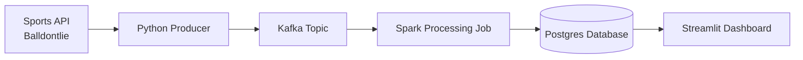

# sports_streaming_pipeline

## Project overview
This project implements an end-to-end data engineering pipeline for ingesting and processing sports data.
The pipeline retrieves data from several sports APIs, streams the data through Kafka, processes it using Spark, 
and stores the results in a PostgreSQL database. A Streamlit application is used to visualize the processed data.
The initial project phase focuses on NBA game score data using the BALldontlie API. Future additions may 
include additional NBA datasets as well as other leagues such as the NFL and NHL.


## AI Used
I had Chatgpt assist in *planning* of this project, inlcuding a lot of the folder structure. 
I did not let the AI write any of the code - it's hard to get better at a skill when you don't practice.
I did have Chatgpt review parts of my code after I wrote it for text based suggestions.


## Architecture


Pipeline flow:

1. A Python producer retrieves sports data from APIs.
2. The producer publishes events to a Kafka topic.
3. Kafka stores the event stream.
4. A Spark job consumes the Kafka topic and processes the data.
5. Processed results are written to a PostgreSQL database.
6. A Streamlit application visualizes the stored data.


## Tech Stack
- Python
- Apache Kafka
- Apache Spark / PySpark
- PostgreSQL
- Streamlit
- Docker


## Quickstart
1. Clone the repository:
```bash
git clone <repo>
cd sports_streaming_pipeline
```

2. Start the services
```bash
docker compose up
```

## Future Improvements
- Build a Streamlit dashboard for visualizing game data
- Expand NBA datasets (teams, player stats, box scores)
- Add additional sports leagues such as the NFL and NHL
- Add scheduling/orchestration for pipeline components
- Improve data modeling and analytics tables
